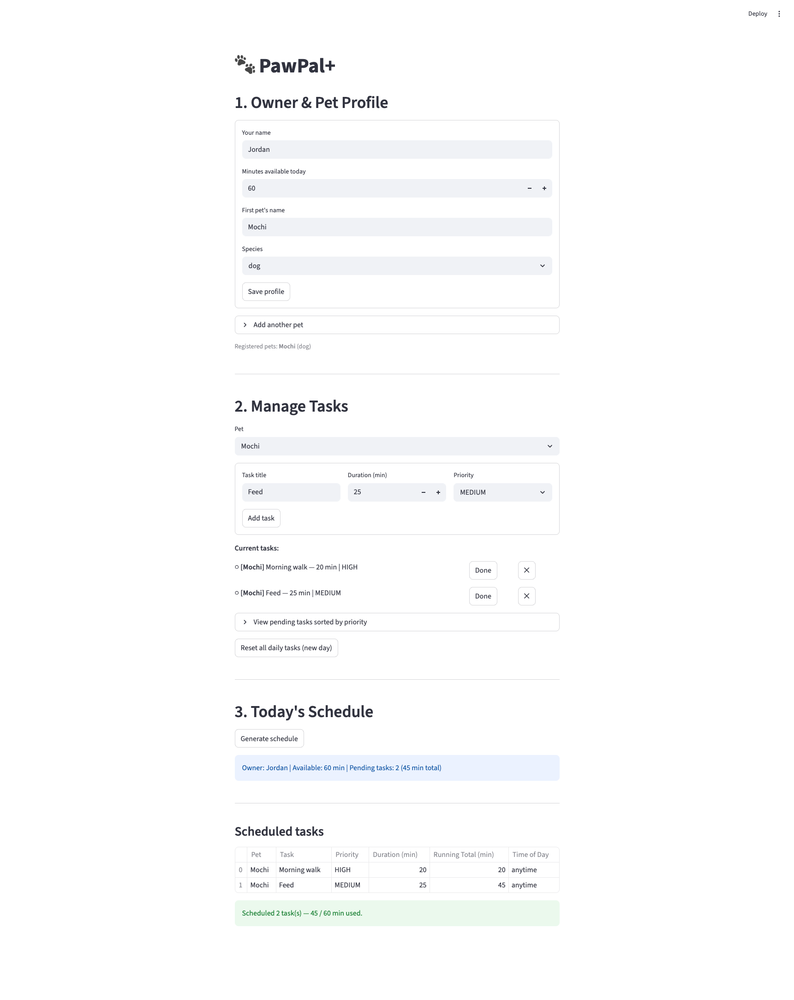

# PawPal+

**PawPal+** is a Streamlit app that helps busy pet owners stay on top of daily care. Enter your available time, add tasks for each pet, and PawPal+ builds a prioritised schedule that fits your day — with smart conflict warnings when something won't work.

---

## Features

### Multi-pet owner profiles

Create an owner profile with a daily time budget (in minutes). Add as many pets as you need — each pet maintains its own independent task list. Duplicate pet names are rejected automatically.

### Task management

Add care tasks to any pet with a title, duration, and priority level (`HIGH`, `MEDIUM`, or `LOW`). Mark tasks complete inline or remove them at any time. A **Reset daily tasks** button clears all `DAILY` tasks at the start of a new day.

### Priority-based greedy scheduling

`Scheduler.build_plan()` uses a two-key sort before scheduling:

1. **Priority (HIGH → LOW)** — critical tasks like medication are always considered before low-priority enrichment activities.
2. **Duration (shortest first, as a tiebreaker)** — when two tasks share the same priority, the shorter one is placed first. This "shortest-job-first" heuristic maximises the number of tasks that fit within the time budget.

Tasks are then greedily selected until the owner's available minutes are exhausted. Tasks that don't fit are moved to a `skipped` list with an explanation.

### Sorting by time of day

Each task carries an optional `time_of_day` field in `"HH:MM"` format (or `"anytime"` if unscheduled). `Scheduler.sort_by_time()` orders all tasks chronologically — zero-padded `"HH:MM"` strings compare correctly with plain string ordering, no `datetime` parsing required. Tasks marked `"anytime"` always sort to the end.

### Daily and weekly recurrence

Each task has a `Frequency` (`DAILY`, `WEEKLY`, or `AS_NEEDED`) and a `due_date`. When `Scheduler.mark_task_complete()` is called, `Task.next_occurrence()` automatically creates the next instance:

- `DAILY` → `due_date + 1 day`
- `WEEKLY` → `due_date + 7 days`
- `AS_NEEDED` → no recurrence (returns `None`, task is not re-queued)

The new instance is appended to the pet's task list immediately.

### Conflict detection

`Scheduler.detect_conflicts()` performs four checks before scheduling and returns human-readable warning strings rather than raising exceptions. The UI shows each conflict inline so the owner can fix problems before generating a plan:

| Conflict type        | What it detects                                               |
| -------------------- | ------------------------------------------------------------- |
| **Time overload**    | Total pending task time exceeds the owner's available minutes |
| **Impossible task**  | A single task is longer than the entire available time window |
| **Duplicate titles** | The same task name appears more than once on the same pet     |
| **Time-slot clash**  | Two or more tasks share an identical `time_of_day` value      |

> **Known limitation:** The clash detector flags tasks with the _same_ `time_of_day` string. It does not detect partial overlaps (e.g. a 30-min task at `07:00` overlapping a task at `07:20`). Full interval arithmetic is a documented future improvement.

### Filtering and querying

- `Scheduler.filter_by_pet(pet_name)` — all tasks for a single named pet
- `Scheduler.filter_by_status(completed)` — pending or completed tasks across all pets
- `Scheduler.due_today()` — all pending `DAILY` tasks
- `Scheduler.high_priority_tasks()` — all pending `HIGH`-priority tasks
- `Scheduler.pending_tasks_by_priority()` — full sorted preview used by the UI's **"View pending tasks"** panel

---

## Getting started

### Requirements

- Python 3.10+
- Dependencies listed in `requirements.txt`

### Installation

```bash
python -m venv .venv
source .venv/bin/activate        # Windows: .venv\Scripts\activate
pip install -r requirements.txt
```

### Running the app

```bash
streamlit run app.py
```

The app opens at `http://localhost:8501`.

---

## App walkthrough

| Step                      | What to do                                                                                                                                             |
| ------------------------- | ------------------------------------------------------------------------------------------------------------------------------------------------------ |
| **1. Create a profile**   | Enter your name, daily time budget, and first pet. Click **Save profile**.                                                                             |
| **2. Add more pets**      | Expand **Add another pet** and submit the form.                                                                                                        |
| **3. Add tasks**          | Select a pet, fill in title / duration / priority, click **Add task**.                                                                                 |
| **4. Review conflicts**   | Any scheduling conflicts (overload, clashes, duplicates) appear immediately below the task list as yellow or red banners.                              |
| **5. Generate your plan** | Click **Generate schedule** in Section 3. The sorted plan is displayed as a table with a running time total. Skipped tasks appear below with a reason. |
| **6. Mark tasks done**    | Click **Done** next to any task. Recurring tasks are re-queued automatically.                                                                          |
| **7. Start a new day**    | Click **Reset all daily tasks** to clear completion status on all `DAILY` tasks.                                                                       |

---

## Project structure

```
app.py               # Streamlit UI
pawpal_system.py     # Core domain model: Priority, Frequency, Task, Pet, Owner, Scheduler, DailyPlan
tests/
  test_pawpal.py     # 27 unit tests covering scheduling, recurrence, and conflict detection
uml_final.png        # Final UML class diagram
uml_final.mmd        # Mermaid source for the diagram
reflection.md        # Design decisions, tradeoffs, and project reflection
```

---

## Running the tests

```bash
python -m pytest
```

### Test coverage summary

The 27 tests in `tests/test_pawpal.py` cover:

- **Task lifecycle** — defaults, `mark_complete()`, `reset()`, idempotency
- **Recurring tasks** — `next_occurrence()` for `DAILY`, `WEEKLY`, and `AS_NEEDED`; auto re-queuing via `Scheduler.mark_task_complete()`
- **Pet task management** — add, remove, pending/completed filtering, `reset_daily_tasks()`
- **Scheduler happy paths** — greedy time budget, HIGH-before-LOW ordering, skipping completed tasks
- **Scheduler edge cases** — empty owner, pet with no tasks, all four `detect_conflicts()` checks
- **Sorting** — `sort_by_time()` with `"HH:MM"` values and `"anytime"` sentinel

All 27 tests pass. Every public method on `Task`, `Pet`, and `Scheduler` is exercised by at least one test.

### Demo Screenshot


