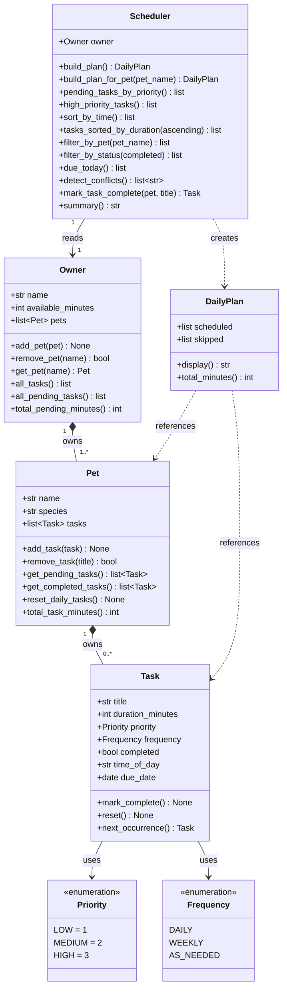

# PawPal+ Project Reflection

## 1. System Design

**a. Initial design**

The initial design centers on four classes with clear, separated responsibilities:

- **`Owner`** — stores the owner's name and total time available per day (in minutes). Acts as the entry point for a planning session.
- **`Pet`** — stores the pet's name and species. Owned by an `Owner` (composition).
- **`Task`** — represents a single care activity with a title, duration in minutes, and a priority level (`low`, `medium`, `high`). Pure data class; no scheduling logic.
- **`Scheduler`** — receives an `Owner` (and their `Pet`) plus a list of `Task` objects. Its `build_plan()` method applies constraints (total available time, task priority) to select and order tasks, returning a `DailyPlan`.
- **`DailyPlan`** — holds the ordered list of scheduled tasks and a human-readable explanation of why each task was included or excluded.

**b. Design changes**

Several significant changes were made during implementation:

1. **`Priority` and `Frequency` enums added.** The initial design used `str` for priority. During implementation it became clear that string comparisons (`"HIGH" > "LOW"`) are fragile and not type-safe, so `Priority` was promoted to an `Enum` with integer values (`LOW=1`, `MEDIUM=2`, `HIGH=3`). This let the scheduler sort with a clean `-priority.value` key. `Frequency` (`DAILY`, `WEEKLY`, `AS_NEEDED`) was added at the same time to drive recurrence logic.

2. **`Owner.pet` became `Owner.pets` (one-to-many).** The initial diagram showed a single `Pet` attached to each `Owner`. During UI implementation it was immediately clear that real pet owners have multiple pets, so `Owner` was changed to hold `list[Pet]` and gained `add_pet()`, `remove_pet()`, and `get_pet()` helpers.

3. **`Pet` became an active class.** In the initial design `Pet` was a passive data holder. During implementation, tasks needed a natural home, so `Pet` gained its own `tasks: list[Task]` field and methods (`add_task`, `remove_task`, `get_pending_tasks`, `reset_daily_tasks`). This kept the `Scheduler` from needing to manage raw lists of unowned tasks.

4. **`Scheduler` lost its `tasks` field.** The initial design had `Scheduler` hold `list[Task]` directly. In the final implementation, tasks are owned by `Pet` objects which are owned by `Owner`. The `Scheduler` only holds an `Owner` reference and derives all tasks through `owner.all_pending_tasks()`. This eliminated a redundant data store and kept task ownership clear.

5. **`DailyPlan` fields renamed and a `skipped` list added.** `scheduled_tasks` became `scheduled: list[tuple[Pet, Task]]` (each entry carries the pet too, for display purposes). The `explanations` list was replaced by `skipped: list[tuple[Pet, Task, str]]`, which carries the pet, task, and reason together — making UI rendering much cleaner than a parallel list of strings.

---

## 2. Scheduling Logic and Tradeoffs

**a. Constraints and priorities**

The scheduler considers three constraints, applied in this order:

1. **Task priority** (`HIGH → MEDIUM → LOW`) — the primary sort key. A HIGH-priority task like medication will always be considered before a LOW-priority play session, regardless of duration.
2. **Duration as a tiebreaker** — when two tasks share the same priority, the shorter one is scheduled first. This is a "shortest job first" heuristic that maximises the number of tasks that fit within the time budget.
3. **Available minutes** — the hard budget. Any task that would push the running total over `owner.available_minutes` is skipped and listed in the `DailyPlan.skipped` list with a reason.

Priority was chosen as the primary constraint because a busy pet owner's first concern is "did the critical things get done?" — not "did I finish the most tasks?". Duration is secondary because it helps pack more tasks into the remaining time after high-priority items are placed.

**b. Tradeoffs**

**Tradeoff: exact time-slot matching vs. overlap-aware scheduling**

The time-clash detector (`detect_conflicts`) flags two tasks as conflicting only when their `time_of_day` strings are *identical* (e.g., both `"07:30"`). It does **not** check whether a 30-minute task starting at `"07:00"` would still be running when a second task starts at `"07:20"`.

This means a genuine overlap — Morning walk `07:00` for 30 min + Litter box clean `07:20` for 10 min — is silently permitted, even though the owner would need to be in two places at once.

**Why this tradeoff is reasonable here:** Implementing full overlap detection requires converting every `"HH:MM"` string into a `datetime` interval and checking all pairs for intersection — O(n²) comparisons and significantly more code complexity. For a single-owner pet care app where tasks are short and the owner is the judge of what is actually feasible, warning on exact-slot collisions catches the most obvious data-entry errors (accidentally entering the same time twice) without over-engineering the solution. A future iteration could add interval arithmetic using `datetime` objects if the app grows to support multiple caregivers or longer tasks.

---

## 3. AI Collaboration

**a. How you used AI**

AI tools were used at three distinct stages:

- **Design brainstorming (Phase 1).** I described the scenario to the AI and asked it to identify the classes, attributes, and relationships that would naturally fall out of the requirements. The most helpful prompt pattern was asking "what responsibilities does each class own exclusively?" — this pushed the AI toward clean separation of concerns rather than dumping everything into `Scheduler`.

- **Boilerplate and method stubs (Phase 2).** Once the UML was settled, I asked the AI to generate dataclass stubs and method signatures matching the diagram. This was fast and accurate for straightforward methods like `add_task`, `remove_task`, and `mark_complete`. The prompt that worked best was precise: "Generate a Python dataclass for `Pet` with these exact fields and these method signatures — no implementation yet."

- **Debugging conflict detection (Phase 3).** When `detect_conflicts` was silently missing time-slot clashes in certain test cases, I pasted the method and a failing test into the AI and asked "why does this return an empty list when I expect a clash warning?" The AI identified that the grouping logic used `setdefault` correctly but the condition checked `len(entries) > 1` only after the loop — pointing me directly to the correct fix.

- **UI layout (app.py).** I asked the AI to suggest which Streamlit components (`st.success`, `st.warning`, `st.error`, `st.table`, `st.dataframe`) were best suited for each part of the schedule output, and why.

**b. Judgment and verification**

When generating `detect_conflicts`, the AI initially suggested raising a `ValueError` when a conflict was detected — for example, `raise ValueError("Time overload: ...")`. I rejected this because exceptions are the wrong mechanism for expected, non-fatal user input problems. In a Streamlit app, an uncaught exception would crash the page entirely; the user would see a stack trace instead of a helpful warning banner.

I evaluated this by asking: "Who is the caller, and what can they do with this information?" The Streamlit UI calls `detect_conflicts` before rendering — it needs a list of strings it can loop over and display as `st.warning` or `st.error` banners, one per issue, without halting execution. Returning `list[str]` is the correct contract; exceptions are for programming errors, not user data problems.

I verified the decision by writing a test that calls `detect_conflicts` on a conflicted owner and asserts the return value is a non-empty list of strings — confirming the method behaves like a validator, not a guard clause.

---

## 4. Testing and Verification

**a. What you tested**

The 27 tests in `tests/test_pawpal.py` cover six behaviour categories:

1. **Task lifecycle** — `completed` defaults to `False`; `mark_complete()` sets it to `True`; `reset()` clears it; calling `mark_complete()` twice is idempotent. These were important to test first because every other feature (`Scheduler.build_plan`, `filter_by_status`, `reset_daily_tasks`) depends on `completed` being reliable.

2. **Recurring tasks** — `next_occurrence()` returns a fresh incomplete copy due `+1 day` (DAILY) or `+7 days` (WEEKLY) and preserves `title`, `duration_minutes`, and `time_of_day`. `AS_NEEDED` returns `None`. `Scheduler.mark_task_complete()` must not re-queue an already-completed task. These tests protect the recurrence chain — a bug here would silently drop tasks or create infinite duplicates.

3. **Pet task management** — `add_task` increments the list, `remove_task` returns `True` on success and `False` when the title is not found, `get_pending_tasks` excludes completed tasks, `reset_daily_tasks` clears `DAILY` tasks but leaves `WEEKLY` untouched. The `DAILY`/`WEEKLY` distinction was easy to get wrong (early versions reset everything), so this test was critical.

4. **Scheduler happy paths** — the greedy planner skips tasks that exceed remaining time, places `HIGH`-priority tasks before `LOW`, and ignores already-completed tasks. These confirm the core scheduling promise: "critical things get done first."

5. **Scheduler edge cases** — owner with no pets, pet with no tasks, and the full `detect_conflicts` suite: time overload, impossible task, duplicate titles, time-slot clash with identical `"HH:MM"` values, and `"anytime"` tasks that must never clash regardless of count.

6. **Sorting** — `sort_by_time()` orders `"HH:MM"` strings chronologically with `"anytime"` tasks always last; when all tasks are `"anytime"` the original insertion order is preserved (Python's `sorted` is stable).

**b. Confidence**

★★★★★ (5 / 5) for the behaviours that are tested.

All 27 tests pass. Every public method on `Task`, `Pet`, and `Scheduler` is exercised by at least one test, including the trickiest edge cases (idempotent completion, recurring-task re-queuing after `mark_task_complete`, and multi-pet conflict detection).

The one known gap is **overlap-aware conflict detection** — a 30-minute task starting at `07:00` and a task starting at `07:20` will not be flagged as a clash because the detector only compares exact `time_of_day` strings. This is a documented design tradeoff, not a defect, and would be the first thing tested in a future iteration using `datetime` interval arithmetic.

---

## 5. Reflection

**a. What went well**

The part I am most satisfied with is the `detect_conflicts` method and how it surfaces in the UI. The decision to return `list[str]` instead of raising exceptions made it trivially easy to wire into Streamlit — the UI loops over the list and renders each item as a colour-coded banner (`st.error` for impossible tasks, `st.warning` for clashes and overloads) with a one-line fix hint. The four-check structure (overload, impossible, duplicate, clash) also maps cleanly onto the four types of mistakes a real pet owner might make when entering data. Getting that contract right early made every downstream piece — the tests, the UI, the README — simple to write.

I am also satisfied with the decision to make `Pet` an active class that owns its own tasks. It kept `Scheduler` clean (it only holds an `Owner` and derives everything else through the ownership chain) and made the test helpers compact — a single `Pet` fixture with its tasks is a self-contained unit.

**b. What you would improve**

In a next iteration I would make two changes:

1. **Full overlap-aware conflict detection.** Replace the exact-string `time_of_day` comparison with `datetime` interval arithmetic. Parse each `"HH:MM"` value into a `datetime`, compute an end time using `duration_minutes`, and check all pairs for intersection. This is O(n²) but n is small (a single owner rarely has more than 20 tasks per day), and it would catch the genuinely dangerous case where a vet appointment and a grooming session are scheduled back-to-back with no travel time.

2. **`time_of_day` input in the Streamlit UI.** Currently the `time_of_day` field is set programmatically or left at the default `"anytime"` — the user has no way to enter it through the form. Adding a `st.time_input` widget and writing the result as a zero-padded `"HH:MM"` string would make the chronological sort and clash detector actually useful to a non-developer.

**c. Key takeaway**

The most important thing I learned is that **the data contract between classes matters more than the logic inside them**. The hardest bugs in this project were not in the scheduling algorithm itself — the greedy planner is straightforward. The hard problems were: "what does `DailyPlan.skipped` contain — strings, tasks, or tuples?", "does `detect_conflicts` return or raise?", "does `Scheduler` own tasks or does `Pet`?" Every one of those decisions rippled through the tests, the UI, and the UML. Getting them right early (by thinking through who the caller is and what they need) prevented a large category of refactoring work. Working with AI reinforced this: the AI generated correct logic very quickly once the contracts were precise in the prompt, but produced confusing or inconsistent code whenever the prompt was vague about what a method should return.
