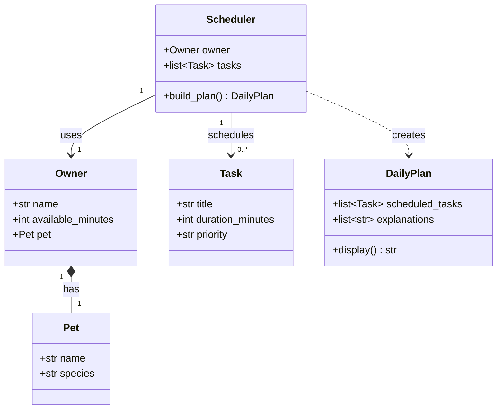

# PawPal+ Project Reflection

## 1. System Design

**a. Initial design**

The initial design centers on four classes with clear, separated responsibilities:

- **`Owner`** — stores the owner's name and total time available per day (in minutes). Acts as the entry point for a planning session.
- **`Pet`** — stores the pet's name and species. Owned by an `Owner` (composition).
- **`Task`** — represents a single care activity with a title, duration in minutes, and a priority level (`low`, `medium`, `high`). Pure data class; no scheduling logic.
- **`Scheduler`** — receives an `Owner` (and their `Pet`) plus a list of `Task` objects. Its `build_plan()` method applies constraints (total available time, task priority) to select and order tasks, returning a `DailyPlan`.
- **`DailyPlan`** — holds the ordered list of scheduled tasks and a human-readable explanation of why each task was included or excluded.

**b. Design changes**

The design has not yet changed from the initial version — implementation is still in progress. One anticipated change is splitting `priority` out of `Task` into a separate `Priority` enum (`LOW`, `MEDIUM`, `HIGH`) so comparisons in the scheduler are type-safe rather than string-based. Another likely change is adding a `time_of_day` preference field to `Task` (e.g., `morning`, `afternoon`, `anytime`) once time-slot ordering becomes a requirement.

---

## 2. Scheduling Logic and Tradeoffs

**a. Constraints and priorities**

The scheduler considers three constraints, applied in this order:

1. **Task priority** (`HIGH → MEDIUM → LOW`) — the primary sort key. A HIGH-priority task like medication will always be considered before a LOW-priority play session, regardless of duration.
2. **Duration as a tiebreaker** — when two tasks share the same priority, the shorter one is scheduled first. This is a "shortest job first" heuristic that maximises the number of tasks that fit within the time budget.
3. **Available minutes** — the hard budget. Any task that would push the running total over `owner.available_minutes` is skipped and listed in the `DailyPlan.skipped` list with a reason.

Priority was chosen as the primary constraint because a busy pet owner's first concern is "did the critical things get done?" — not "did I finish the most tasks?". Duration is secondary because it helps pack more tasks into the remaining time after high-priority items are placed.

**b. Tradeoffs**

**Tradeoff: exact time-slot matching vs. overlap-aware scheduling**

The time-clash detector (`detect_conflicts`) flags two tasks as conflicting only when their `time_of_day` strings are *identical* (e.g., both `"07:30"`). It does **not** check whether a 30-minute task starting at `"07:00"` would still be running when a second task starts at `"07:20"`.

This means a genuine overlap — Morning walk `07:00` for 30 min + Litter box clean `07:20` for 10 min — is silently permitted, even though the owner would need to be in two places at once.

**Why this tradeoff is reasonable here:** Implementing full overlap detection requires converting every `"HH:MM"` string into a `datetime` interval and checking all pairs for intersection — O(n²) comparisons and significantly more code complexity. For a single-owner pet care app where tasks are short and the owner is the judge of what is actually feasible, warning on exact-slot collisions catches the most obvious data-entry errors (accidentally entering the same time twice) without over-engineering the solution. A future iteration could add interval arithmetic using `datetime` objects if the app grows to support multiple caregivers or longer tasks.

---

## 3. AI Collaboration

**a. How you used AI**

- How did you use AI tools during this project (for example: design brainstorming, debugging, refactoring)?
- What kinds of prompts or questions were most helpful?

**b. Judgment and verification**

- Describe one moment where you did not accept an AI suggestion as-is.
- How did you evaluate or verify what the AI suggested?

---

## 4. Testing and Verification

**a. What you tested**

- What behaviors did you test?
- Why were these tests important?

**b. Confidence**

- How confident are you that your scheduler works correctly?
- What edge cases would you test next if you had more time?

---

## 5. Reflection

**a. What went well**

- What part of this project are you most satisfied with?

**b. What you would improve**

- If you had another iteration, what would you improve or redesign?

**c. Key takeaway**

- What is one important thing you learned about designing systems or working with AI on this project?
